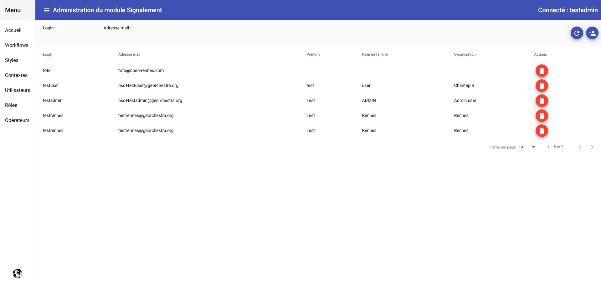

# Signalement Back-Office

## Généralités

L'application **Signalement Back-Office** permet de réaliser un certain nombre de configuraton à partir d'une interface WEB.

**/!\ Remarques:**

* Le backoffice ne permet pas :
    * De configurer les zones géographiques - les zones géographiques sont les différentes communes de la métropole aux quelles vient s'ajouter la métropole dans son ensemble
    * De configurer les formulaires associés aux différentes étapes du workflow
    * De configurer les courriels envoyés aux différentes étapes du workflow

## Accueil

L'accès à l'application back-office se fait - après authentification avec les droits adéquats - depuis l'URL :

```
https://portail-test.sig.rennesmetropole.fr/signalement-admin
```

La page d'accueil comporte un entête et un menu burger.


Le menu comporte les entrées suivantes :

- Accueil
- Workflows
- Styles
- Contextes
- Utilisateurs
- Rôles 
- Opérateurs

## Workflows

Cette page permet :

* De lister les workflows existants avec pagination et tri avec pour chacun d'eux :

    * Nom : le nom du processus
    * Version	: la version courante du processus
    * Nom de la ressource : le nom du fichier utilisé pour le téléchargement
    * Clef : le nom unique de la ressource
    * Description	: la description du worklow
    * Actions : les actions possibles

* De téléverser un nouveau workflow ou une nouvelle version d'un workflow existant.

* De supprimer une version d'un workflow


### Workflow suppression

En Sélectionnant la corbeille sur une ligne du tableau, il est possible après confirmation de supprimer une version de workflow.
Si un workflow est encore actif sur une version, il n'est pas possible de la supprimer.

### Workflow téléversement <a name="workflow-upload">&lt;&gt;</a>

En cliquant sur le bouton en haut à droite du formulaire une popin s'affiche et permet de sélectionner un fichier et un nom pour le téléchargement.


Après validation du formulaire, le workflow est téléversé et ajouté à la liste.
Si la clé contenu dans le fichier téléversée existe déjà, la version est incrémentée.

## Styles

## Contextes

Cette page permet :

* De lister les contextes existants avec pagination et tri avec pour chacun d'eux :

    * Id Thème/Couche : l'identifiant du contexte
    * Description : la description du contexte
    * Type de contexte : le type du contexte (couche ou thème)
    * Type de géographie : le type de dessin possible sur le contexte (point, ligne ou polygone)
    * Workflow : la clé du workflow telle qu'elle présente dans le tableau "liste des workflows"
    * Version du workflow : la version du workflow sur laquelle s'applique le contexte (ou null si le contexte s'applique à la dernière version du workflow
    * Actions : les actions possible

* De créer un nouveau contexte

* De supprimer un contexte


### Contexte suppression

En Sélectionnant la corbeille sur une ligne du tableau, il est possible après confirmation de supprimer un contexte.

### Contexte création <a name="contexte-create">&lt;&gt;</a>

En cliquant sur le bouton en haut à droite du formulaire une popin s'affiche et permet de créer un contexte.


### Contexte modification

En cliquant sur le crayon sur une ligne du tableau, il est possible de modifier un contexte existant.


**/!\ Remarque :** il n'est pas possible de modifier le type et la géométrie d'un contexte apprès sa création.

### Contexte visualisation cartographique

En cliquan sur l'icon "carte" il est possible de visualiser la couche correspondant au contexte.
Cette action n'est pertinente que pour les contextes de type "Couche".

## Utilisateurs

Cette page permet :

* De lister les utilisateur existants avec pagination et tri avec pour chacun d'eux :

    * Login : le login de l'utilisateur
    * Prénom : prénom de l'utilisateur récupéré la première connexion de celui-ci
    * Nom de famile : nom de famille de l'utilisateur récupéré la première connexion de celui-ci
    * Organisation : organisation de l'utilisateur récupéré la première connexion de celui-ci
    * Actions : les actions possibles

* De créer un nouvel utilisateur

* De supprimer un utilisateur



### Utilisateur suppression

En Sélectionnant la corbeille sur une ligne du tableau, il est possible après confirmation de supprimer un utilisateur.

Il n'est pas possible supprimer un utilisateur présent dans la page "Operateurs".

### Utilisateur création

En cliquant sur le bouton en haut à droite du formulaire une popin s'affiche et permet de créer un utilisateur en saisissant son login et son adresse courriel.

Les autres données sont récupérées à la première connexion de l'utilisateur.


## Rôles

**/!\ Remarques:** on désigne par "rôle" les rôles utilisés dans les workflows.

Cette page permet :

* De lister les rôles existants avec pagination et tri avec pour chacun d'eux :

    * Nom : le nom unique du rôle
    * Libellé : le libellé du rôle
    * Actions : les actions possibles

* De créer un nouveau rôle

* De supprimer un rôle


### Rôles suppression

En Sélectionnant la corbeille sur une ligne du tableau, il est possible après confirmation de supprimer un rôle.

Il n'est pas possible supprimer un rôle présent dans la page "Operateurs".

### Rôles création <a name="role-creation">&lt;&gt;</a>

En cliquant sur le bouton en haut à droite du formulaire une popin s'affiche et permet de créer un rôle en saisissant son nom et son libellé.


## Opérateurs

**/!\ Remarques:** on désigne par "Opérateur" le lien entre un utilisateur, un rôle, une zone géographique et un contexte.

Cette page permet :

* De lister les associations existantes avec pagination et tri avec pour chacune d'elles :

    * Utilisateur : l'utilisateur concernée par l'association
    * Libellé : le libellé du rôle
    * Actions : les actions possibles

* De créer un nouveau rôle

* De supprimer un rôle


### Opérateur suppression

En Sélectionnant la corbeille sur une ligne du tableau, il est possible après confirmation de supprimer une association.

### Opérateur création <a name="operateur-creation">&lt;&gt;</a>
 
En cliquant sur le bouton en haut à droite du formulaire une popin s'affiche et permet de créer une association en saisissant les différents éléments


