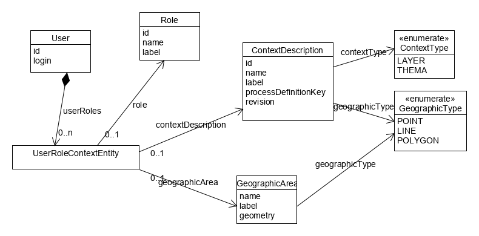

# Gestion des droits 

La classe *User* permet de gérer les utilisateurs potentiellement concernés par un signalement.
Les *User*s , identifiés par leur login, doivent aussi être présents dans le LDAP.

La classe *ContextDescription* permet de lister les thèmes et les couches candidates pour un signalement.
Chaque contexte indique s'il s'agit d'un thème ou d'une couche, s'il s'agit d'une sélection par point, ligne ou polygone.
Chaque contexte est associé à un processus (et éventuellement une version de ce processus) qui sera utilisé lors de la création d'un signalement.

Un utilisateur peut être associé par le biais de la classe *UserRoleContext* :
* A une liste de rôles, 
* A une liste de couples (rôle, context)
* A une liste de triplets (rôle, context, aire géographique)