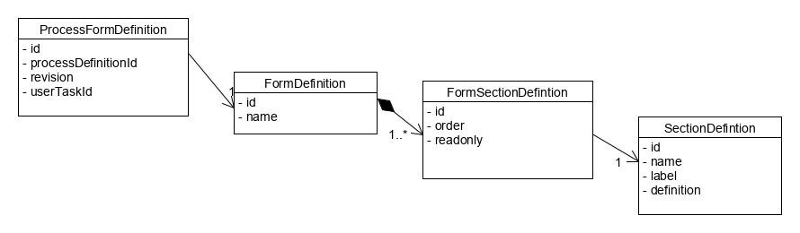

# Configuration des champs de formulaire d'une étape



Il est possible d'associer à une étape utilisateur un formulaire sous la forme d'un FormDefinition au moyen de la classe *ProcessFormDefinition*.
Si aucune version n'est précisée (*version = null*), toutes les versions sont impactées.

Chaque formulaire est associé à une liste de sections par le biais de la classe *FormSectionDefintion*.
Cette classe de liaison permet de définir :
* l'ordre d'affichage grâce aux champ order
* si la section est en lecture seule pour ce formulaire (par exemple pour afficher le commentaire d'une étape précédente non modifiable).

Chaque section possède (*SectionDefintion*):
* un nom unique, 
* un libellé,
* une définition sous le forme d'un flux json.

Le flux json est constitué comme suit:

```java
{
"fieldDefinitions": [
		{
		"name": <string>,
		"label": <string>,
		"type": ("STRING"|"BOOLEAN"|"LONG"|"DOUBLE"|"LIST"),
		"readOnly": false|true,
		"required": false|true,
		"multiple": false|true,
		"extendedType": "<flux json d'une liste d'objet avec code et label>",
		"validators": [
			{
				"type": ("MAXLENGTH"|"POSITIVE"|"NEGATIVE"),
				"attribute": ("<integer pour maxlength>"|null)
			}
		]
	},...
]
}
```

En résumé pour positionner un formulaire à une étape, il faut :
* Créer une section décrivant les champs
* Créer un formulaire et associer les sections. Il est possible de réutiliser des sections entre plusieurs formulaires en indiquant si dans ce formulaire la section est en lecture seule ou non
* Créer un "ProcessFormDefinition" en associant le formulaire à un processus (par son identifiant unique) et éventuellement un version et à une étape utilisateur (visible dans le fichier de workflow BPMN).
